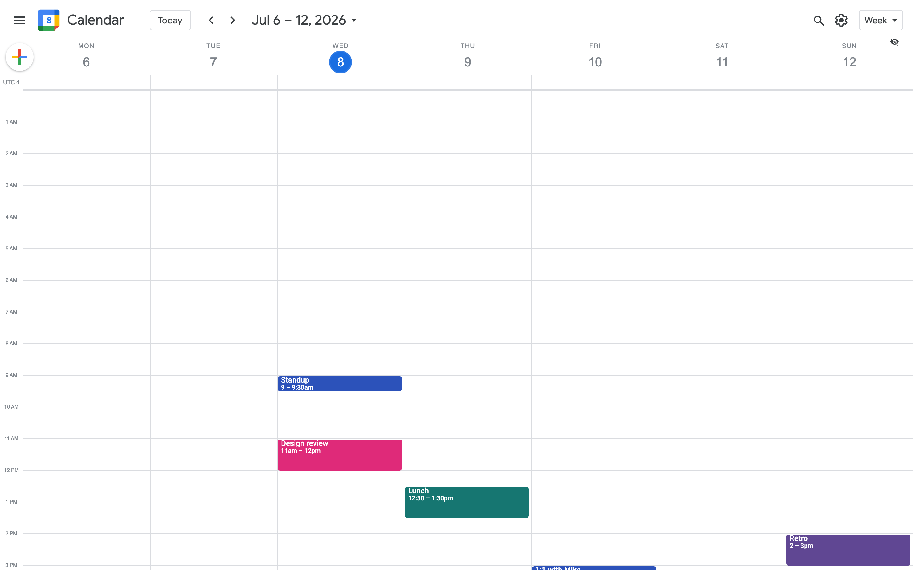
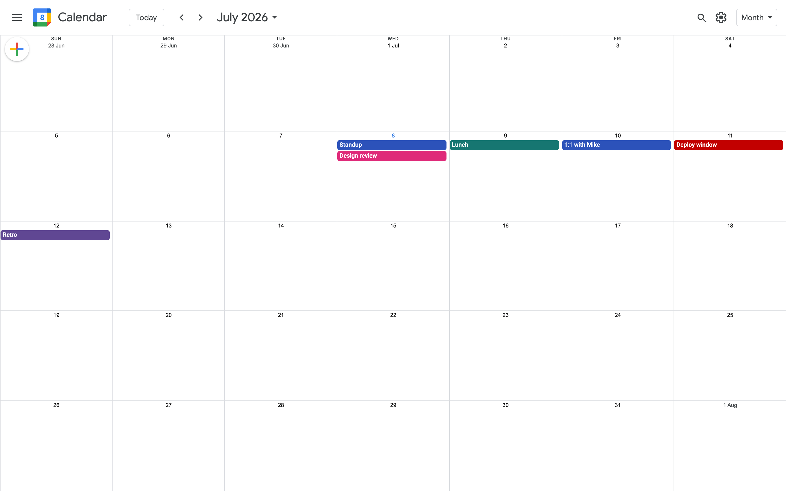
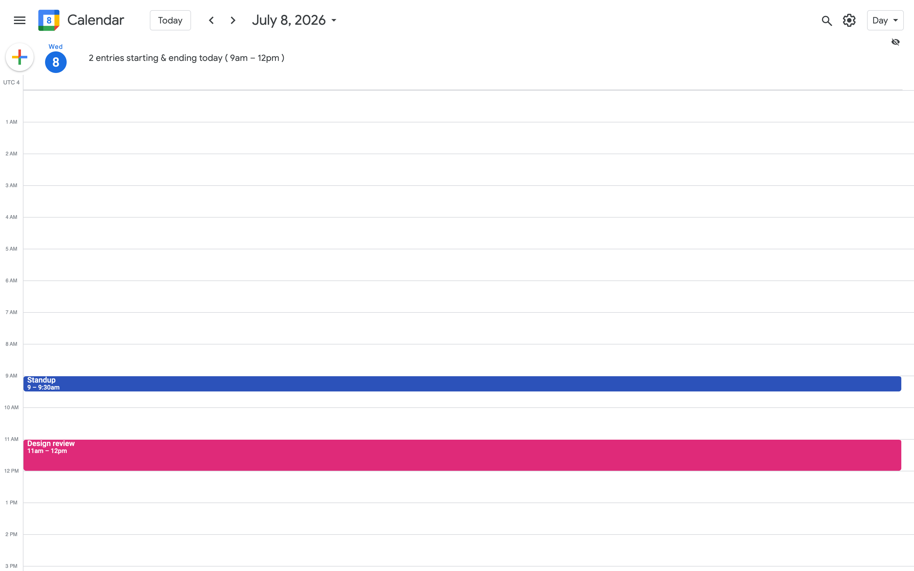
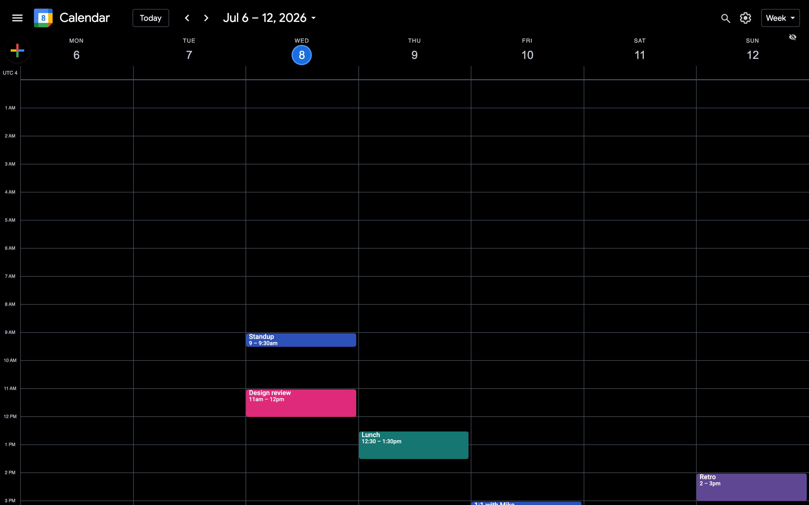
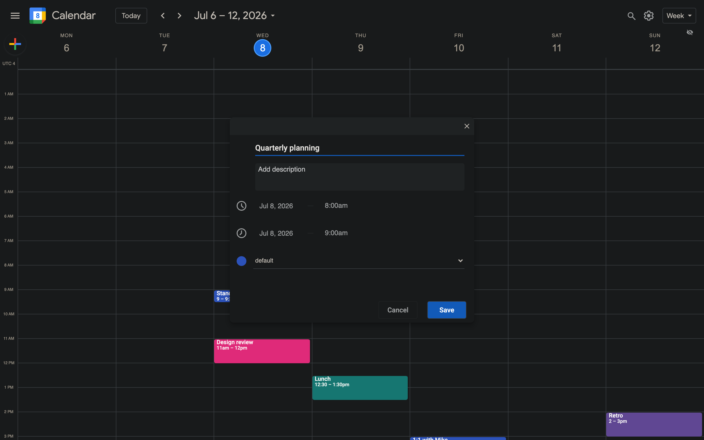

# Calendar

A calendar single-page application built with React, Vite, and Redux Toolkit.

It began as an exercise: take a well-made vanilla-JavaScript Google Calendar
clone and rebuild it in React — not to copy the output, but to earn the
understanding. Every interaction was studied in the original, then
re-implemented from first principles. What remains is a faithful,
self-contained calendar that owes its behaviour to careful study rather than
imitation.

Not affiliated with Google. Built for learning, kept honest by testing against
the reference at every step.



<table>
  <tr>
    <td></td>
    <td></td>
  </tr>
  <tr>
    <td></td>
    <td></td>
  </tr>
</table>

## Features

- **Five views** — Day, Week, Month, Year, and Agenda.
- **Events** — create, edit, and delete through a draggable form with custom
  date and time pickers. Deletion asks first.
- **Direct manipulation** — drag events on a 15-minute grid, resize them, move
  them across days in the week view or across cells in the month view. A ghost
  placeholder marks the origin while dragging.
- **Concurrent events** — Google-style layout: a cascade for a few overlapping
  events, equal side-by-side lanes when many collide, so none is ever buried.
- **Categories** — colour-coded, filterable, with a per-category menu (edit,
  show only this, show all but this). Renames follow through to their events.
- **Navigation** — header and sidebar datepickers, a "go to date" search that
  parses several formats, prev/next and Today.
- **Preferences** — light, dark, and high-contrast themes; toggleable keyboard
  shortcuts; toggleable animations. All persisted.
- **Backup** — export everything to JSON and import it back. The importer also
  accepts the original vanilla project's export format and rejects anything it
  does not understand rather than corrupting your data.
- **Persistence** — state lives in `localStorage`; nothing is lost on reload.

## Stack

- React 18 with hooks
- Vite
- Redux Toolkit, Reselect
- react-intl (en / fr / es), styled-components
- Vitest

## Getting started

Requires a recent Node.js (18+).

```bash
npm install
npm run start:dev     # development server
npm run build         # production build
npm run preview       # serve the production build
npm test              # run the test suite
```

## Architecture

The application is organised by responsibility rather than by view.

```
src/
  components/     # UI, grouped by feature; *.controller.js holds view logic
    View/         # the five calendar views and their scheduling grids
    Modals/       # event form, entry details, settings, search, category menu
    Sidebar/      # mini datepicker and categories
    Draggable/    # the shared drag/resize engine
  store/          # Redux: actions, reducers, selectors, persistence
  utils/          # pure helpers — entry layout, dates, times, backup, favicon
  constants/      # views, themes, modal sections, labels
  static/css/     # stylesheets ported from the reference
```

Two ideas carry most of the weight:

- **Positions are derived, never stored.** An event knows only its start and
  end times. Grid coordinates, box dimensions, and overlap lanes are computed
  on render (`utils/entries.js`). Backups therefore keep only what matters and
  recompute the rest.
- **One drag engine.** `Draggable.Element` handles vertical snapping,
  resizing, and horizontal column movement, snapping to a 15-minute (12.5px)
  grid. The week and day cells wrap their events in it; the month view has its
  own cell-to-cell variant.

## Configuration

Environment variables follow Vite's convention:

```bash
.env                 # loaded in all cases
.env.local           # loaded in all cases, git-ignored
.env.[mode]          # loaded for the given mode
.env.[mode].local    # loaded for the given mode, git-ignored
```

A `.env.sample` is included as a starting point.

## Acknowledgement

The behaviour and much of the styling trace back to Chase Ottofy's
[vanilla Google Calendar clone](https://github.com/chaseottofy/google-calendar-clone-vanilla).
This project is an independent React reimplementation built to learn from it.

## License

See [LICENSE](LICENSE).
